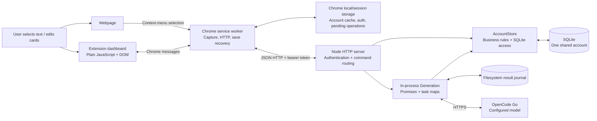
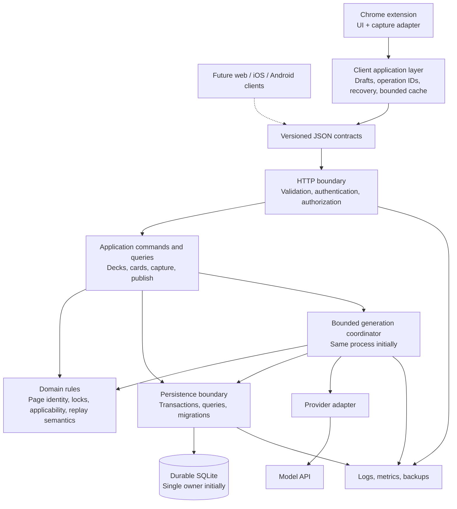

# Vocabularium Architecture & Scalability Audit

Date: 21 September 2026.

**Assessment: retain the current monolith and SQLite, fix several correctness and recovery problems, then improve data access and module boundaries incrementally. A rewrite is not justified.**

The implementation is reasonably disciplined for a small owner-tested prototype. Its strongest parts are transactional saves, operation replay, stable page identities, generation isolation, and browser-lifecycle testing.

Its principal limitations are:

- It implements **one shared account**, not a multi-user product.
- The documented deployment deliberately uses disposable storage.
- Synchronization repeatedly transfers and stores the entire account.
- Model requests have no global concurrency or cost controls.
- Authentication failures can enter the editor’s save-success path.
- Recovery depends on several loosely defined contracts across browser storage, HTTP, SQLite, and a filesystem journal.

No repository files were modified during the audit. This report was subsequently saved at the owner’s request; its recommendations have not been implemented.

## Audit scope and evidence

Audited revision: **`b73ca22`**, package version **0.2.2**.

The audit covered the product specifications, production backend and extension, prototype, database schema, tests, build/package scripts, CI, and deployment records.

Verification performed with Node **24.19.0**:

| Check | Result |
|---|---|
| Syntax, JSON, whitespace checker | Passed: 88 files |
| Existing unit/API suite | Passed: 49 tests |
| Existing browser suite | 15 passed, 1 failed |
| Isolated rerun of failed browser scenario | Passed |
| Expired-authentication save probe | Confirmed non-error `{ signedIn: false }` response |
| Malformed nested-input probes | Confirmed unclassified `TypeError` failures |
| SQLite query-plan inspection | Confirmed scans and temporary sorting |
| Final working-tree check at audit completion | Clean |

The browser failure occurred in the lost-acknowledgment scenario. Inspection identified an ordering race in its test synchronization, discussed below. The isolated pass does **not** make the original full-suite run green.

The audit did not run live generation, mutate the hosted account, verify current hosting settings, perform load testing, or scan dependencies against a vulnerability database. Deployment conclusions distinguish checked-in configuration from historical deployment evidence.

## 1. Current architecture

Vocabularium consists of a **Chrome Manifest V3 extension and a single Node HTTP server**. There is one npm package, no workspace/package architecture, no frontend framework, and no separate worker service.



### Applications and boundaries

**Extension UI.** [app.js](../../extension/app.js) handles login, hash routing, dashboard rendering, lists, and periodic refresh. Separate modules provide card editing, deck configuration, dialogs, feedback, sorting, and themes.

**Extension service worker.** [background.js](../../extension/background.js) owns API requests, authentication state, installation/session initialization, account caching, message dispatch, context-menu updates, and recovery alarms. [capture.js](../../extension/capture.js) implements capture submission and publication polling.

**Backend.** [app.mjs](../../src/server/app.mjs), `createApplication()` (line 43), creates the HTTP server, store, authentication service, and generation coordinator. It uses Node’s built-in HTTP server directly.

**Persistence and business rules.** [AccountStore](../../src/core/store.mjs) (line 19) combines SQL access, transaction management, idempotency, deck/card rules, and generation-state transitions.

**Generation.** [Generation](../../src/server/generation.mjs) (line 6) runs asynchronous provider calls inside the API process. Work is represented by in-memory task maps and persistent attempt records. This is asynchronous processing, but **not a durable job queue**.

**Provider integration.** [OpenCodeProvider](../../src/server/opencode.mjs) (line 14) calls the OpenCode Go chat-completions endpoint. The configured default model is `deepseek-v4.1-flash`. Requests have a 60-second timeout and 4,096-token output budget. There is no automatic model fallback.

### Authentication and user management

[Authentication](../../src/server/auth.mjs) implements:

- One built-in `admin` account with password `admin`.
- Salted scrypt password hashing.
- Random bearer tokens; only token hashes are stored server-side.
- Seven-day token expiry.
- Revocation of the current token on logout.

There is no registration, account isolation, password-management flow, authorization role model, or tenant ownership in the schema. This matches the current MVP scope.

### Configuration and deployment

Server configuration comes from environment variables:

- `HOST`, `PORT`, `DATA_DIR`
- `OPENCODE_API_KEY`, `OPENCODE_MODEL`

The extension’s API origin is configured at build time. [build.mjs](../../scripts/build.mjs) validates the origin and writes matching host permissions. Remote origins must use HTTPS.

[render.yaml](../../render.yaml) describes one free Node service, automatic deployments disabled, with SQLite under `.data` and no persistent disk.

The [delivery record](../M6-Delivery.md) identifies a historical deployed backend revision. It explicitly warns that merging newer code does not redeploy that backend. The current deployment was not inspected during this audit.

### Main data flows

**Login and synchronization**

`Dashboard → worker → /api/login → credentials/token tables → local auth`

Then:

`Worker → /api/session → installation registration → /api/account → entire account cached locally → dashboard`

**Capture**

1. Context-menu action records the selection and a local recovery receipt.
2. `/api/capture/prepare` freezes the server’s default-deck snapshot.
3. `/api/capture` transactionally creates the card, pages, attempts, and operation receipt.
4. Generation determines one interpretation and generates applicable module outputs.
5. Complete page results are staged in SQLite, with filesystem recovery support.
6. The originating browser polls and calls `/api/publish`.
7. Publication transactionally changes page content/status.
8. The extension fetches the entire account again.

**Manual save**

`Editor draft → durable local operation → HTTP command → validation + transaction + receipt → account refresh → draft cleared`

The last step currently has an authentication-result bug.

**Page retry**

`Confirmation → retry command → clear target page + create attempt → generate → stage → originating-session publication`

**Browser interruption**

A new browser session increments the installation epoch. Session registration fails unfinished attempts from the previous session. Late results cannot publish.

This detects interruption on reopening; it does not provide an instantaneous server notification when Chrome exits.

## 2. Repository structure

| Directory/module | Current responsibility | Dependencies and consumers | Boundary assessment |
|---|---|---|---|
| [extension](../../extension) | Production Chrome client, UI, transport, cache, recovery | Chrome APIs, DOM; backend JSON API | Platform boundary is clear; internal state ownership is less clear |
| [app.js](../../extension/app.js) | Routing, login, dashboard/lists, refresh coordination | Most UI modules; Chrome storage/messages | Several UI responsibilities, but only 221 lines |
| [background.js](../../extension/background.js) | Authentication, initialization, HTTP, dispatch, synchronization | Capture/save/menu modules; Chrome APIs | Main client-side coordination hotspot |
| [save-operations.js](../../extension/save-operations.js) | Durable operation receipts and explicit recovery | Injected request/storage; consumed by worker/capture | Useful, compact abstraction |
| [cards.js](../../extension/cards.js) | Card rendering, drafts, save/retry/delete flows | DOM helpers, messaging, browser storage | Rendering and mutation-state logic are intertwined |
| [configuration.js](../../extension/configuration.js) | Deck drafts, previews, configuration saving | Module catalog, dialogs, messaging | Separate save lifecycle duplicates some editor concerns |
| [src/core](../../src/core) | Store and module execution | SQLite, crypto, **extension module catalog** | “Core” includes infrastructure and depends on a platform directory |
| [src/server](../../src/server) | HTTP, auth, generation, provider, startup | Core, filesystem, environment, external provider | Appropriate deployment boundary; direct SQL leaks across modules |
| [prototypes](../../prototypes) | Original local lifecycle laboratory | Production store; used by foundation browser tests | Still active test infrastructure, not simply dead code |
| [tests](../../tests) | Logic, API, browser, hosted smoke tests | Node test runner, Playwright, injectable providers | Strong behavioral coverage; large browser scenarios and shared ports |
| [scripts](../../scripts) | Checking, copying/building, ZIP packaging, smoke checks | Node, Python standard library | Simple and understandable |
| [docs](..) | Specifications, historical plans, acceptance and evidence | Human workflow | Useful, but historical and current operational facts require careful reading |
| [.github/workflows/verify.yml](../../.github/workflows/verify.yml) | Linux/Windows logic/package checks; Linux browser checks | npm, Python, Playwright | Good baseline CI |

The most important boundary problems are:

1. Server core imports its module catalog from the extension.
2. Authentication and generation access `store.db` directly.
3. UI modules manipulate durable save records that the worker also owns.
4. Transport results mix authentication state, mutation acknowledgment, and refreshed account state.

## 3. Codebase health

### Harmless messiness

These do not justify a rewrite:

- Dense one-line JavaScript statements.
- Small DOM helper functions.
- Direct HTTP route dispatch through an `if/else` chain.
- A hard-coded provider user-agent version older than the package version.
- Static example previews separate from live generation.
- Lack of a frontend framework or ORM.

The largest production file is the 366-line store. The 221-line dashboard and 190-line worker are not inherently oversized. Their **combined responsibilities**, rather than line counts, are the concern.

No production TODO/FIXME markers or circular static imports were found in the inspected module graph.

### Maintainability problems

**Implicit contracts.** API bodies, worker messages, cached account objects, and pending receipts have no shared contract definitions. Naming mixes `cardId` with database-shaped `card_id`, and `pageId` with `page_id`.

**Business rules and SQL are intertwined.** `AccountStore` is coherent today, but generation reaches into its database for recovery and cancellation queries. This will make changes to persistence or execution topology harder.

**Duplicate definitions.** Default deck layouts exist in both `AccountStore.createDeck()` and `newDeckDraft()`. Session/capture validation is distributed across HTTP and store layers. Interpretation validation exists both in the provider adapter and core; defense-in-depth is appropriate, but definitions can drift.

**State spread across storage mechanisms.** Account/auth/receipts use Chrome local storage; browser identity uses Chrome session storage; card drafts use DOM `sessionStorage`; configuration drafts live in memory; sort preferences use `localStorage`.

Those choices have different lifetimes, but those lifetimes are not represented by an explicit state model.

### Confirmed or strongly supported bug risks

**Authentication failure treated as save completion.**

At [background.js](../../extension/background.js), line 165, a mutation’s HTTP 401 becomes `{ signedIn: false }`. The dashboard’s `send()` throws only when `result.error` exists.

At [cards.js](../../extension/cards.js), line 33, the editor then clears its draft without requiring a successful save acknowledgment. Deck configuration has the same general success-path assumption.

The targeted probe confirmed this response shape. In the 401 case, the worker retains a recovery receipt, so this is not necessarily permanent loss of all submitted text. However:

- The editable draft is cleared incorrectly.
- New-card navigation can lack a returned card ID.
- Rendering after authentication loss can fail.
- If authentication is already absent before dispatch, the worker returns early without even creating a recovery receipt.

This should be fixed before further feature work.

**Malformed nested input becomes HTTP 500.**

Examples include `pages: [null]` for manual creation and `changes: [null]` for saving. Store validation dereferences these elements before checking their shape. Capture validation similarly assumes each page is non-null.

The probes confirmed unclassified `TypeError` exceptions. Transactions protect the affected commands from partial writes, but client errors are misclassified and diagnostics are poor.

**Recovery records accumulate indefinitely.**

Successful `capture-*` records remain in local storage, including selected text and configuration snapshots. Account refreshes also cache all card content. Rendering and recovery frequently call `storage.local.get(null)`.

The extension does not request `unlimitedStorage`; Chrome documents a 10 MB local-storage limit. This can become a functional failure for one heavy user, independent of total user count. [Chrome storage documentation](https://developer.chrome.com/docs/extensions/reference/api/storage)

**Cancellation can leave obsolete provider work running.**

[Generation.cancelDeleted()](../../src/server/generation.mjs), line 100, aborts page tasks when attempt rows disappear. Session interruption changes attempts to `failed` without deleting them. Already-running module calls can therefore continue even though their results can no longer publish.

The publication fence protects data, but this wastes provider capacity and potentially money.

### Test-maintenance problem

The failed [browser scenario](../../tests/app.browser.test.mjs), around line 763, waits for “Try saving again” to appear before applying a “later” server edit.

The editor displays that label as soon as a pending operation exists, including while the original request is still running. Therefore the test does not establish that the original save committed before the later edit.

The observed failure and isolated pass support a test-ordering race; they do not establish broken server idempotency. The test should wait for the committed receipt and the settled failed-acknowledgment state.

## 4. Data architecture

### Current model

The schema is defined in [store.mjs](../../src/core/store.mjs), line 23, and [auth.mjs](../../src/server/auth.mjs), line 9.

| Entity | Stored data | Relationships/ownership |
|---|---|---|
| `account` | Default deck | Exactly one row, constrained to ID 1 |
| `decks` | ID, name | All belong implicitly to the shared account |
| `layout_pages` | Stable page ID, deck, position, modules JSON | Deck → many layout pages |
| `cards` | Deck, original selection, creation time, interpretation JSON | Deck → many cards |
| `pages` | Card/page identity, text, status, attempt ID | Card × current layout page |
| `installations` | Installation ID, epoch, session ID | Browser-session fencing |
| `attempts` | Card/page, originating session, module snapshot, state, staged result | Generation history and current work |
| `receipts` | Operation ID, fingerprint, result JSON, sequence | Global successful-command replay |
| `credentials` | Username, salt, password hash | Built-in administrator |
| `login_tokens` | Hashed token, expiry | No account/user association needed in current singleton model |

Important properties:

- Cards belong to exactly one deck.
- Stable layout-page IDs preserve content when other pages are removed.
- Foreign keys cascade deck/card/page deletion.
- Original selection, generated interpretation, layout instructions, and editable page text are separate.
- Modules and interpretations are stored as JSON text; page content remains plain text.
- Ownership is implicit, not tenant-scoped.

### Other persistence

- **Chrome local storage:** auth, full account cache, capture receipts, pending saves, installation ID/epoch, theme.
- **Chrome session storage:** current browser-session identity and transient feedback metadata.
- **DOM session storage:** card editing draft.
- **DOM local storage:** sorting preferences.
- **Filesystem outbox:** generated results awaiting successful SQLite staging.

The filesystem outbox and SQLite database are on the same storage volume. The outbox is recovery support, **not a backup**.

### Transactions and concurrency

[AccountStore.command()](../../src/core/store.mjs), line 75, uses `BEGIN IMMEDIATE` and commits the mutation together with its operation receipt.

This provides:

- Atomic multi-page saves.
- Safe replay after a lost acknowledgment.
- Rejection of an operation ID reused with a different payload.
- Serialization of complete commands in one process.
- No provider/network work inside write transactions.

“FIFO” is effectively the order commands reach the synchronous transaction handler after body parsing, not strict TCP connection-arrival order.

Other transitions—interpretation persistence and result staging—occur separately. The receipt sequence is consequently **not a complete account revision**: some observable state changes, including startup recovery, occur without a new command receipt.

### Indexes and queries

Only primary-key and unique-constraint indexes exist.

`account()` loads every deck and every card. For `D` decks and `C` cards, it performs approximately:

**`4 + 2D + 2C` SQL queries**, excluding authentication.

The query-plan probes confirmed:

- Full card scan plus temporary sort for creation ordering.
- Full attempts scan for session polling.
- Full layout-page scan plus temporary sort for deck layout.

Useful future indexes, tied to existing queries, include:

- `layout_pages(deck_id, position)`
- `cards(deck_id, created_at, id)` for paginated deck lists
- `attempts(installation_id, session_id, state)`
- `attempts(card_id, state)`
- `pages(page_id)` for page deletion/content checks
- `pages(attempt_id)` for attempt-related page updates

Adding indexes alone will not fix whole-account transfer and N+1 reads.

### Integrity and migrations

Foreign keys and transactions are good foundations. Some invariants exist only in code:

- Page and card must belong to the same deck.
- Status/state values must be valid.
- Page positions and module identities must satisfy layout rules.
- `pages.attempt_id` must identify the intended attempt.

That is manageable with one controlled writer, but should be documented and tested before introducing more writers.

Migration handling is currently:

1. `CREATE TABLE IF NOT EXISTS`
2. Inspect `cards` columns
3. Conditionally add `interpretation`

There is no schema version, migration history, compatibility gate, or migration fixture suite.

### Is SQLite appropriate?

**Yes—for the current single-process, owner-tested application.**

The schema is relational, transactions are short, and database access is server-mediated. SQLite is not the first component that needs replacing.

SQLite permits one writer at a time; whether that matters depends on transaction duration and workload, not registered-user count. [SQLite guidance](https://www.sqlite.org/whentouse.html)

Address these first:

1. Durable storage and tested recovery.
2. Bounded reads and client storage.
3. Query shape and indexes.
4. Generation admission control.
5. Measurement.

**Concrete PostgreSQL migration triggers:**

- Multiple API hosts need concurrent access to the same writable database.
- Measured write serialization exceeds the agreed latency budget after query/transaction optimization.
- Required availability cannot tolerate one database host.
- Backup/restore times exceed recovery objectives.
- Operational requirements demand managed replication or point-in-time recovery.

Do not place the WAL database on a shared network filesystem to simulate a distributed database; WAL requires participating processes on the same host. [SQLite WAL documentation](https://www.sqlite.org/wal.html)

## 5. Scalability analysis

### The prerequisite: real users do not exist yet

The current system cannot safely serve 100 independent accounts, let alone one million: every login accesses the same data.

The following projections assume account ownership and authorization are added when product scope expands. They are **risk forecasts, not measured capacities**.

| Approximate registered users | Likely constraints | Appropriate response |
|---|---|---|
| **100** | Account isolation, durable hosting, provider limits, public API abuse; heavy individual collections may hit local-storage limits | Keep one backend and SQLite if measured load permits. Add ownership, secure auth, bounded generation, backups, and bounded reads |
| **1,000** | Polling multiplication, full-account serialization, local cache size, synchronous DB/auth work, receipt accumulation | Paginate, index, coalesce refreshes, instrument event-loop/DB time, establish retention policies |
| **10,000** | Provider concurrency/cost and active-client traffic become important; one process may reach its practical latency budget | Use measured load tests. Add durable scheduling or separate generation workers only if needed; evaluate PostgreSQL against topology and latency needs |
| **100,000** | A substantially active population will stress single-host availability, polling, job throughput, and operations | Multiple API/worker instances and a shared database become likely; incremental synchronization becomes important |
| **1,000,000** | Active-session volume, model spend, data retention, recovery operations, abuse control | Partition workloads only where measurements justify it; consider read replicas or regional architecture for explicit requirements |

One million registered but mostly inactive users is a different workload from ten thousand users capturing simultaneously.

### First bottleneck: whole-account synchronization

Current schedules are:

- Visible dashboard: every five seconds.
- Browser recovery alarm: every 30 seconds.
- Active generation: poll, publish ready results, fetch the entire account, then wait one second.

For `V` visible dashboards, the dashboard timer alone requests approximately **`V / 5` full snapshots per second**. Thus 1,000 simultaneously visible dashboards imply roughly 200 snapshot requests/second before background polling or mutations. This is arithmetic from the code, not a capacity claim.

Each snapshot incurs:

- N+1 SQL work.
- JSON construction and transfer of all page content.
- Full local-storage replacement.
- JSON comparisons in the UI.
- Potential list reconstruction and sorting.

**Address when:** account snapshots become noticeably slow, collections approach local-storage limits, or synchronization dominates API work. Bounded list APIs are worth planning before large collections accumulate.

### Second bottleneck: model calls

Generation launches pages concurrently across all captures; modules within each page execute sequentially. There is no global semaphore, per-account quota, queue bound, or budget counter.

Typical default-layout behavior:

- Word/phrase: one interpretation plus one content-generation call.
- Sentence: one interpretation; explanation module skipped.
- Selection-only layout: no model call.

Repeated-example checks can request up to three outputs per module. With unrestricted module counts, neither total page duration nor total request count is bounded by the per-request timeout.

**Address when:** before untrusted access, shared-provider use, or concurrent generation regularly occurs. Begin with bounded in-process concurrency and explicit admission rules, not a queue service.

### Third bottleneck: synchronous event-loop work

The same Node event loop handles:

- HTTP.
- `DatabaseSync`.
- `scryptSync`.
- JSON serialization.
- Synchronous outbox writes and flushes.

A large account refresh, login burst, or deck-wide layout change can delay unrelated API work.

**Address when:** metrics show event-loop delay or API latency correlated with these operations. Async password hashing and bounded queries are simpler first steps than adding servers.

### Storage, caching, and retention

There is no server response cache or incremental synchronization feed. There is an unbounded client account cache.

Attempts remain until their parent content is deleted; successful command receipts remain indefinitely. Local successful capture receipts also remain indefinitely.

**Address when:** now for local receipt cleanup; soon for a server retention contract. Deleting server receipts casually would break replay guarantees.

### Cost scaling

The provider is the likely dominant variable cost:

`captures × interpretation/generation calls × tokens`, plus explicit retries and duplicate-output retries.

The implementation does not record provider usage or distinguish throttling from other provider failures. Hosting bandwidth also scales poorly because every refresh transfers complete account contents.

The repository’s successful provider samples establish integration, not production capacity, quotas, or commercial suitability.

## 6. Reliability and maintainability

### Strong existing mechanisms

The following are worth preserving:

- Transactional mutation-plus-receipt commits.
- Canonical payload fingerprints.
- Stable operation IDs through retries.
- Distinction between resaving and regenerating.
- Atomic page publication.
- Cross-installation generation locks.
- Stable page identities.
- Session/attempt fencing against stale output.
- Durable local save records.
- Filesystem recovery of generated output after failed staging.
- Browser tests covering worker suspension and abrupt browser termination.

These are substantive reliability features.

### Remaining gaps

**Authentication and mutation results are conflated.** This is the immediate editor correctness problem.

**Generation failures lose their cause.** [Generation.start()](../../src/server/generation.mjs), line 70, collapses errors to `{ ok: false }`. Timeout, invalid output, provider authentication, rate limiting, and cancellation become indistinguishable.

**Recovery errors can be silent.** Several filesystem/staging failures are caught without structured logging. Corrupt journal files and disk failures can be difficult to diagnose.

**No operational metrics.** There are no request-duration histograms, provider usage counters, attempt-age measurements, event-loop measurements, or outbox-backlog alerts.

**Health is shallow.** `/health` returns `{ ok: true }`; it does not establish writable persistence or generation configuration. Provider outages should not necessarily fail API liveness, but readiness and diagnostics need clearer meanings.

**Backups and restore procedures are absent.** Durable disk alone would not solve deletion, filesystem failure, or operator mistakes.

**Reset identity is absent.** Clients have installation/session IDs but no explicit database/account incarnation identifier. After a backend reset, cached IDs and old operations belong to a vanished database. The detailed stale-client/pending-save reset scenario is explicitly deferred in the specifications.

**Horizontal startup is unsafe.** The generation constructor fails all unstaged loading attempts on startup. Starting a second process against a shared store could mark another process’s live work failed. Separate local databases would instead diverge.

**API evolution is implicit.** There is no protocol version or capability negotiation despite extension packages potentially outliving backend revisions.

### Test coverage assessment

Coverage is stronger than average for a repository of this size, particularly around replay, deletion, generation locks, and browser lifetime.

Important missing coverage:

- Expired/missing auth during card and deck saving.
- Local-storage quota exhaustion.
- Malformed nested request values.
- Database-version migrations.
- Backup restoration.
- Backend reset with pending operations.
- Provider admission limits and cancellation after session invalidation.
- Large-account query/payload behavior.
- Multiple-process ownership, if that topology is ever introduced.

The browser suite’s 1,067-line application test file is a maintenance hotspot. Extract fixtures and establish explicit commit/acknowledgment barriers; do not merely increase timeouts.

## 7. Lightweight security review

### Sound choices

- Model credentials remain server-side.
- Environment secret files are ignored.
- Extension packages contain client code and configuration, not backend credentials.
- Passwords use salted scrypt; tokens are random and hashed at rest.
- SQL uses bound parameters.
- UI renders user/model content through plain text rather than HTML.
- Provider responses are validated before staging.
- HTTP bodies have a 1 MiB limit.
- Extension local storage is restricted to trusted extension contexts.
- Worker message handling checks extension origin.
- Remote builds require HTTPS.

### Architectural risks

**Default credentials are a public-access blocker.** Anyone who knows the documented credentials can access the shared account and initiate provider usage. This is intentional test behavior, but unsuitable for confidential data or public service.

**No login or generation rate limiting.** Unauthenticated login attempts perform synchronous scrypt work. Authenticated callers can launch unrestricted generation.

**CORS is not authorization.** The server permits any syntactically valid Chrome-extension origin and accepts requests without an Origin header. Bearer authentication remains the actual boundary.

**No user ownership.** Adding a users table alone would be insufficient: cards, decks, tokens, installations, receipts, and pending client operations all need account association and authorization checks.

**Sensitive selection retention.** Selected text is sent to the provider and retained in cards and local capture receipts. Deleting a server card does not remove the successful local receipt containing its selection. Logout removes auth/account cache, but retains recovery records and capture history.

A retention policy must distinguish recoverable unsaved work from obsolete saved copies.

**Validation is incomplete.** The body limit does not replace domain limits on selections, page text, names, modules, and concurrent requests. Some malformed values currently produce internal errors.

**Dependency surface is small.** There are no production npm dependencies; Playwright is the principal development dependency. The lockfile and `npm ci` are positives. Node, bundled SQLite, browser tooling, and CI actions still require patch management. No assertion of “no known vulnerabilities” is made here.

## 8. Architecture problems

Severity describes technical impact. “Production” distinguishes future deployment blockers from accepted owner-test constraints.

| Issue | Location | Severity | Why it matters | Fix now? | Suggested approach |
|---|---|---|---|---|---|
| Auth failure enters save-success path | `background.run()`, `cardViews.save()`, configuration saving | **High** | Clears drafts without confirmed persistence; can lose recovery when auth is already absent | **Yes** | Separate mutation acknowledgment from access state; retain drafts until explicit success |
| Disposable hosted persistence | Render configuration; delivery record | **Critical for durable use** | Complete account and recovery records can disappear | Before valuable data | Persistent storage plus tested backup/restore; retain test exception only for disposable testing |
| Public default credentials; no tenant isolation | `Authentication`; store schema | **Critical for public multi-user use** | Shared-data access and uncontrolled provider usage | Before scope expansion | Secure provisioning/auth; account-scoped ownership and authorization |
| Unbounded model execution | `Generation.start()`, `renderPage()` | **High** | Provider exhaustion, cost spikes, resource pressure | Before shared/public use | In-process concurrency bound, admission rules, usage metrics |
| Unbounded local captures/account cache | `captureRuntime`, `refreshAccount()`, UI rendering | **High** | Quota exhaustion blocks capture and synchronization | **Yes** | Remove acknowledged obsolete captures safely; bound cache; reserve pending-save capacity |
| Entire-account N+1 reads | `AccountStore.account()/cards()/card()` | **Medium, increasing with data** | Repeated SQL, serialization, transfer, storage and render work | Soon | Summary/list/detail reads, pagination, indexes |
| Missing supporting indexes | Store schema and polling queries | **Medium** | Scans grow with cards, layouts and attempts | With read cleanup | Add query-specific indexes and verify plans |
| Generation diagnostics discarded | Generation catches; provider errors | **Medium** | Failures and cost cannot be explained operationally | **Yes** | Safe error categories and correlated structured events |
| Single-process ownership is implicit | Generation startup/task maps | **High if replicated** | Another instance can fail live work or diverge | Document now | Enforce one owner; introduce leases only before multiple executors |
| Nested validation holes | HTTP validators; manual/save methods | **Medium** | Client errors become 500s; malformed structures reach domain code | **Yes** | Reusable boundary validators and negative tests |
| Obsolete attempts continue model work | `cancelDeleted()` | **Medium** | Wasted provider usage after session invalidation | Soon | Cancel based on current attempt/session state |
| No versioned migrations or restore verification | Store/auth constructors | **High before persistent schema evolution** | Risky upgrades and uncertain recovery | Before next schema change | Ordered migrations and old-database fixtures |
| Core depends on extension; raw DB access leaks | Core module import; auth/generation | **Medium** | Makes reuse and replacement harder | Incrementally | Neutral shared catalog; explicit store operations |
| Server receipts/attempt history never pruned | `receipts`, `attempts` | **Medium over time** | Storage and scans grow without limit | Define policy soon | Explicit replay horizon/acknowledgment contract before pruning |
| Browser reliability test has ordering race | Application browser test around line 763 | **Medium** | Unreliable release evidence for a critical invariant | **Yes** | Wait for committed operation and settled acknowledgment failure |
| Receipt sequence is not a full revision | `account()`, staging/startup recovery | **Medium for future sync** | Naive sequence-based caching could miss changes | Before incremental sync | Dedicated account revision/change feed covering all relevant transitions |

## 9. Refactoring / cleanup plan

These are proposed changes only. Limits, account expansion, or altered generation behavior require corresponding specification decisions.

### Phase 1 — Safe cleanup

| Refactor | Affected code / problem | Benefit | Risk | Prerequisite verification | Timing |
|---|---|---|---|---|---|
| Make the flaky browser test wait for actual commit/failure | Lost-acknowledgment scenario | Trustworthy replay evidence | Low | Preserve intervening-edit assertion and original operation ID | Now |
| Validate nested objects before dereferencing | HTTP/store input validation | Predictable 400 responses, no accidental internal exceptions | Low | Null/scalar/duplicate-ID cases; assert no mutation | Now |
| Add safe diagnostic events | API and generation error paths | Distinguish timeout, provider rejection, cancellation and persistence failure | Low if payloads excluded | Assert logs exclude tokens, keys and selected text | Now |
| Document execution and persistence invariants | Operational docs | Prevent accidental multi-instance deployment and incorrect backups | Low | Cross-check code and deployment configuration | Now |
| Clarify historical versus current instructions | README/delivery material | Avoid wrong package, prototype or backend assumptions | Low | Verify commands and links | Now |

### Phase 2 — Structural cleanup

| Refactor | Affected code / problem | Benefit | Risk | Prerequisite tests | Timing |
|---|---|---|---|---|---|
| Separate command results from auth/refresh results | Worker messaging, card/config saves | Fix false save success and preserve drafts | Medium | 401 before commit, expired auth after commit, missing auth, re-login and replay | First structural change |
| Give the worker ownership of durable operation storage | UI receipt deletion and worker recovery | Fewer hidden storage conventions; clearer save lifecycle | Medium | Discard, uncertain commit, worker restart, changed payload | Now |
| Bound successful local capture retention | Capture handoff and cached account storage | Prevent quota growth and obsolete-text retention | Medium | Delayed account refresh, no disappearing rows, pending operations never pruned, quota failure | Now |
| Extract a neutral shared catalog and contract definitions | Extension/core imports; repeated shapes/defaults | Explicit reusable boundaries without a framework | Low–medium | Catalog/default-layout parity and message/API contract tests | During adjacent work |
| Encapsulate database operations and add migrations | Store, auth, generation direct SQL | Preserve invariants and enable safe schema changes | Medium | Existing transaction/recovery suite plus old-schema upgrade fixtures | Before schema expansion |
| Replace whole-account list reads | Store queries, API, dashboard/cache | Bounded work, smaller payloads and storage | Medium | Stable sort ties, pagination, deletion, recent-capture handoff, query plans | Soon |

Do not simultaneously migrate language, framework, persistence, and UI state. Each change should preserve the existing replay and interruption contract.

### Phase 3 — Architecture improvements

| Improvement | Affected code / problem | Benefit | Risk | Prerequisite tests | Timing |
|---|---|---|---|---|---|
| Durable hosting and restore procedure | Deployment/data directory | Retains valuable data and provides recovery | Medium operational risk | Restart/redeploy persistence; restore including generation recovery state | Before non-disposable use |
| Bounded generation admission and cancellation | Generation/provider orchestration | Predictable resource usage and cost | Medium; visible overload behavior needs specification | Fairness, overload, queued cancellation, no duplicate calls | Before shared/public use |
| Basic operational telemetry | HTTP, store, generation | Evidence for scaling decisions | Low–medium | Redaction, metric correctness, failure-path events | Soon |
| Explicit backend incarnation and client compatibility | API metadata and recovery | Distinguish stale database state from temporary disconnection | Medium | Reset with old tokens, captures, edits and receipts | Before relying on reset recovery |
| Multi-account ownership/authentication | Schema, auth, API authorization, client storage | Supports independent users | High relative to current scope | Cross-account access denial for every entity/operation; logout/account-switch recovery | Only when scope expands |

### Phase 4 — Scale-triggered changes

| Change | Problem and affected components | Benefit | Risk | Prerequisite tests | Trigger |
|---|---|---|---|---|---|
| PostgreSQL | Single writable host / serialized writes | Shared durable database and stronger operational options | High migration risk | Data migration, concurrency, replay, page-lock and deletion tests | Multi-host requirement or measured writer saturation |
| Durable worker scheduling | In-process task ownership | Independent generation execution and restart-safe claims | High | Duplicate delivery, leases, cancellation, stale publication | API and generation need separate scaling or execution guarantees change |
| Incremental synchronization | Repeated snapshot transfer | Lower read/transfer cost | Medium–high | Change ordering, deletions, cursor expiry, full resync, startup failures | Snapshots dominate workload despite pagination |
| Push notifications/SSE/WebSockets | Polling cost or freshness requirements | Fewer empty polls / faster updates | Medium | Disconnect, reconnect, missed events, browser suspension | Measured polling cost or explicit latency requirement |
| IndexedDB client cache | Chrome local-storage capacity and large collections | Larger, queryable bounded client cache | Medium | Cache migration, eviction, pending-operation durability | Working set no longer fits a small metadata cache |
| Replicas, partitioning, regional services | Proven read/write/geographic constraints | Targeted capacity or availability | High | Failover, replication lag, partition ownership, recovery | Measured need; not registered-user count alone |

A queue must not silently change the current rule that an interrupted browser attempt fails rather than automatically resumes.

## 10. Target architecture

The next target should remain **one deployable backend with explicit internal boundaries**.



Key boundaries:

- HTTP validates transport shapes; domain operations enforce business invariants.
- Persistence owns SQL and transactions.
- Generation owns execution, cancellation and provider coordination.
- The provider adapter owns external protocol and response validation.
- Clients own drafts and recoverable pending actions, not authoritative saved state.
- Platform APIs stay inside client adapters.

Native clients should share the API contract and behavioral rules. They do not need to share Chrome code or adopt a JavaScript runtime.

The existing `interpret()` / `generate()` provider interface is already an adequate replacement seam. A provider plugin framework is unnecessary.

## 11. Recommended repository structure

A workspace/monorepo conversion is unnecessary. Introduce directories only as responsibilities are extracted.

```text
extension/
  app.js                    # Composition and routing
  background.js             # Chrome event composition
  ui/                       # Cards, decks, dialogs, feedback
  client/                   # API client, operations, cache, draft state
  platform/                 # Chrome storage, sessions, menus, alarms
  assets/                   # Existing CSS/HTML where useful

src/
  shared/
    modules.mjs             # Platform-neutral module catalog
    contracts.mjs           # Request/result shapes and validation
  domain/
    modules.mjs             # Applicability and page rendering rules
    errors.mjs              # Stable domain error codes
  application/
    account.mjs             # Command/query coordination
    generation.mjs          # Bounded generation orchestration
  infrastructure/
    sqlite/
      store.mjs             # Concrete persistence implementation
      migrations/           # Ordered schema upgrades
    providers/
      opencode.mjs          # External API adapter
    generation-journal.mjs  # Filesystem recovery implementation
  server/
    app.mjs                 # HTTP boundary and composition
    auth.mjs
    start.mjs

tests/
  unit/
  integration/
  browser/
  fixtures/

scripts/
docs/
  decisions/
  operations/
  evidence/
prototypes/                 # Retain while foundation tests depend on it
```

This is a destination, not a bulk file-moving task.

Initially, moving the module catalog into a neutral location and extracting API/result contracts would provide more value than reorganizing every UI file.

Avoid one repository class per database table, generic service layers, or empty interfaces created only for hypothetical future replacements.

## 12. Decision log

| Decision | Current approach | Remain? | Alternatives | Trigger for reconsideration |
|---|---|---|---|---|
| Database | SQLite WAL, synchronous single writer | **Yes initially** | PostgreSQL; partitioned SQLite | Multi-host writes, measured latency limits, recovery/availability requirements |
| Deployment unit | One Node process | **Yes** | Separate API and generation workers; services | Independently measured scaling or failure-isolation need |
| Authoritative storage | Server database; client cache/pending operations | **Yes** | Local-first synchronization | Explicit offline editing/product requirement |
| Accounts | One shared administrator | **Only for owner testing** | Multi-account service; managed identity | First independent user or confidential account |
| API | JSON command endpoints plus full snapshot | Commands yes; snapshot should evolve | Paginated query endpoints and revision feed | Large collections, multiple clients, compatibility needs |
| Save ordering | Server command order; later same-page save wins | **Yes** | Optimistic concurrency or merge | Product requirement to warn about conflicting edits |
| Idempotency | Global operation IDs and permanent receipts | Keep semantics; define retention | Account-scoped IDs and acknowledged replay horizon | Multi-account support or material history growth |
| Generation lifetime | Browser-session-owned attempts | **Yes under current specification** | Server-owned jobs surviving client exit | Explicit product change, especially mobile lifecycle requirements |
| Provider boundary | Small injectable adapter | **Yes** | Additional concrete adapters | Availability, quality, quota or commercial requirements |
| Background work | In-process promises and persistent attempts | **Yes with bounds** | Durable queue and leased workers | Separate execution scaling or altered recovery guarantee |
| Synchronization | Polling and full snapshots | Temporarily | Paginated refresh, deltas, push hints | Measured transfer cost or freshness requirement |
| Caching | Entire account in Chrome local storage | **No long-term** | Bounded metadata cache; IndexedDB | Collection growth and storage pressure |
| Shared code | Server imports extension module definitions | Change incrementally | Neutral shared modules/contracts | Next related maintenance change |
| Migrations | Constructor DDL and conditional ALTER | Change before further schema work | Versioned migrations | Next persistent schema change |
| Backups | None in repository | **No for durable use** | Consistent database snapshots and off-host backups | First valuable stored data |

Document especially the distinction between:

- successful persistence and successful generation;
- retrying a save and regenerating a page;
- stopping a service worker and ending a browser session;
- an operation sequence and a complete account revision.

Those distinctions underpin much of the current correctness.

## 13. Final assessment

### Keep

- Single backend deployment.
- SQLite for the current workload and topology.
- Transactional operation receipts and canonical fingerprints.
- Stable page identities and generation-session fencing.
- Atomic page publication and explicit save recovery.
- Plain-text content rendering.
- Small injectable model adapter.
- Existing lifecycle and cross-installation tests.

### Clean Up Now

- Fix authentication failures entering save-success paths.
- Correct the browser test’s commit-ordering race.
- Harden nested input validation.
- Bound successful local capture-receipt retention.
- Add safe generation/persistence diagnostics.
- Document the single-process ownership requirement.

### Improve Soon

- Paginated summary/detail reads and supporting indexes.
- Explicit API, worker-message and operation-result contracts.
- Versioned migrations.
- Cancellation of obsolete generation.
- Provider concurrency and usage controls.
- Durable hosting with tested backup restoration before valuable data is stored.

### Leave Alone for Now

- Vanilla JavaScript and direct DOM rendering.
- Node’s built-in HTTP server.
- SQLite itself.
- Small concrete provider abstraction.
- JSON module configurations.
- Plain-text page storage.
- The prototype while tests still use it.
- Microservices, Redis, external queues, sharding and multi-region deployment.

### Scale Triggers

- **First independent account:** implement ownership and authorization.
- **First non-disposable data:** durable storage and restore verification.
- **Untrusted/shared generation access:** admission limits and usage controls.
- **Growing local storage:** bounded cache/receipt retention; consider IndexedDB before quota failure.
- **Snapshot/query work dominates latency:** pagination, indexed queries, then incremental synchronization.
- **API latency suffers from generation execution:** separate execution only after measurement.
- **Multiple writable application hosts are required:** shared database plus explicit task ownership; PostgreSQL becomes a strong choice.
- **Measured database or recovery limits exceed agreed objectives:** migrate based on those limits, not user-count milestones.
