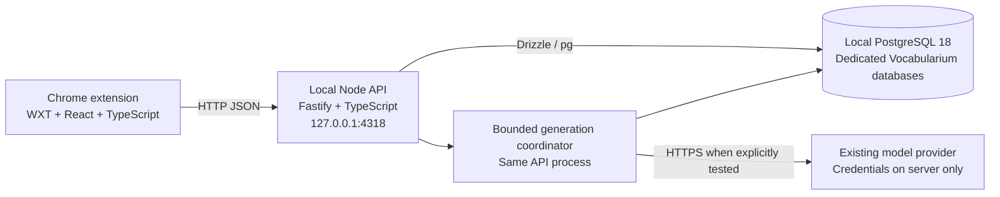

# v0.3.0 — Standard stack and local PostgreSQL migration

**Status: owner authorized implementation on 22 September 2026. Stages 1–4 are under review; Stage 5 is in progress and stages 6–7 remain.**

Prepared on 22 September 2026. Baseline: `main` at `b73ca22`, package 0.2.2. See the [architecture audit](architecture-audit-2026-09.md).

Stage 4 tracking: [issue #48](https://github.com/Guccimane44/Vocalbularium/issues/48) and [PR #49](https://github.com/Guccimane44/Vocalbularium/pull/49). See the [local PostgreSQL workflow](local-postgresql.md) and [verification evidence](../evidence/v0.3.0-stage4-postgresql.md). Stage 5 tracks the [WXT build](https://github.com/Guccimane44/Vocalbularium/issues/50) and [React views](https://github.com/Guccimane44/Vocalbularium/issues/51) separately. Stage 6 tracks [bounded reads](https://github.com/Guccimane44/Vocalbularium/issues/53) and [generation work](https://github.com/Guccimane44/Vocalbularium/issues/52); [Stage 7](https://github.com/Guccimane44/Vocalbularium/issues/54) covers local candidate acceptance.

GitHub milestone: [v0.3.0](https://github.com/Guccimane44/Vocalbularium/milestone/3), without a due date. Implementation is organized into reviewable stages.

## Objective

Make Vocabularium easier to extend and maintain using TypeScript, a conventional extension/UI toolchain, a structured Node backend, and PostgreSQL running on the owner's development machine. Preserve the accepted product behavior. Prepare the same application for later deployment to Render or a comparable host without another database-engine migration.

v0.3.0 is a local development and architecture milestone, not a public launch or hosted deployment. The owner's authorization to proceed covers this migration plan; hosted deployment remains outside its scope.

## Proposed decisions

| Area | v0.3.0 decision |
| --- | --- |
| Language | TypeScript with strict checking; convert incrementally rather than renaming everything at once. |
| Extension | WXT for building and packaging; React for dashboard, configuration and card views. Preserve existing CSS and visual behavior. |
| Backend | Node 24 and Fastify, with application/domain code independent of HTTP handlers. |
| Contracts | TypeBox/JSON Schema for runtime validation and inferred TypeScript types; generate an OpenAPI description for the HTTP API. |
| Database | PostgreSQL 18 locally; Drizzle with the `pg` driver and reviewed, versioned SQL migrations. |
| Repository | Small npm workspace: extension, API, shared contracts and portable domain logic. No additional monorepo orchestration tool. |
| Execution | One API process and an in-process generation coordinator with bounded concurrency. PostgreSQL does not imply multiple API instances. |
| Authentication | Retain the existing single-account owner-testing behavior on loopback. Registration and public authentication are separate work. |
| Tests | Preserve the existing behavioral assertions and Playwright scenarios; adapt integration tests to isolated real PostgreSQL databases. Keep the Node test runner where practical. |
| Hosting | Local API and database now; document a future hosted release procedure. Do not deploy or alter the existing Render service. |

Exact library versions will be selected and locked at implementation time after compatibility checks. No UI redesign, provider/model switch, or new learning feature belongs to this milestone.

## Local development topology



Machine inspection found an Apple Silicon Mac with Homebrew PostgreSQL 18.6 and `psql` installed. `brew services list` reports `postgresql@18` as `none`; it is not running as a Homebrew-managed service. This does not prove that no manually started PostgreSQL process exists. Implementation must check listeners and existing clusters before starting anything.

Use the installed Homebrew PostgreSQL instead of introducing Docker as a local prerequisite. CI may use a PostgreSQL service container on Linux. Record the shared major version and patch-update policy.

Planned local setup:

- A dedicated development database, proposed name `vocabularium_dev`.
- Separate disposable test databases, with unique names for concurrent test runs.
- A non-superuser application role; separate setup/migration privileges where needed. Do not run normal API requests as the machine's database administrator.
- Loopback-only API/database access. Inspect existing cluster configuration before making changes; do not alter unrelated databases or roles.
- Server-only `DATABASE_URL` and provider credentials in ignored environment configuration. Example files contain placeholders.
- Development data survives restarting the API, PostgreSQL and the machine.
- Explicit backup/restore and test-reset workflows. Test tooling refuses to reset the development database.
- Generated setup, development, migration and verification commands are documented only after they exist and have been tested.

The Chrome extension connects to the API, never directly to PostgreSQL. Local hosting is not fully offline: real model generation still requires an external provider. Automated checks use controlled providers.

`localhost` on a separate Windows PC refers to that PC, not this Mac. The v0.3.0 acceptance target is Chrome on this development machine. Remote-device access or a private tunnel requires a separately defined setup; do not expose the local development API publicly to reproduce hosted testing.

## Scope boundaries

### Included

- Strict types, shared contracts, explicit save/authentication results and consistent errors.
- Fastify HTTP boundary and encapsulated database access.
- PostgreSQL schema, migrations, transaction/concurrency behavior and optional legacy-data import.
- WXT build migration followed by React UI migration.
- Bounded list reads, supporting indexes and bounded retention of acknowledged local captures.
- Conservative generation concurrency control, cancellation and safe diagnostics.
- Local development workflow, isolated PostgreSQL CI, restore rehearsal and extension package verification.
- Migration and release documentation, including later hosted deployment prerequisites.

### Deferred

- Registration, multiple user accounts, public onboarding and password-management features.
- Web, iOS and Android clients. Contracts should accommodate them, but no client is built now.
- Redis, external queues, microservices, distributed workers, replicas and multi-region infrastructure.
- Rich-text editing, new module types, spaced repetition and generation-quality evaluation.
- Push synchronization. Start with bounded polling and avoid a second synchronization redesign.
- Actual Render deployment, hosting purchases, existing hosted-account export or teardown.
- Automatic retries of interrupted generation or failed saves. Preserve the existing explicit-recovery contract.

The shared contracts and persistence boundary must not assume Chrome objects. Account identity should be explicit at the application/persistence boundary even while there is only one account; that is not a claim that multi-tenant authorization is complete.

## Implementation sequence and review gates

Each stage should produce a focused PR under the v0.3.0 milestone. The sequence is deliberately incremental; scope or behavior changes are reviewed independently from tool migrations.

### 1. Stabilize the behavioral baseline

Affected code: `extension/background.js`, `extension/cards.js`, `extension/configuration.js`, API validators and the assembled reliability browser test.

- Fix expired/missing authentication being treated as successful persistence. Clear drafts only after a confirmed mutation acknowledgment.
- Cover authentication loss before transmission, after commit, and during refresh; preserve the original operation through recovery.
- Make the lost-acknowledgment test wait for actual committed state and settled response failure.
- Add nested malformed-input regressions and preserve transaction rollback.

**Exit:** the existing suites and added regressions pass consistently, with no change to accepted UI or retry rules. Risk: low to medium. This is the reference behavior for subsequent migrations.

### 2. Establish TypeScript, workspace and contracts

Proposed structure:

```text
apps/
  extension/                # Chrome entrypoints, UI and platform adapters
  api/                      # HTTP, application services, DB and generation
packages/
  contracts/                # HTTP/message schemas and stable result/error types
  domain/                   # Portable module definitions and pure rules
tests/
  integration/
  browser/
  fixtures/
docs/
  architecture/
```

- Add strict type checking and build configuration; allow a temporary mixed JS/TS transition. Remove `allowJs` when the remaining product adapters have migrated to TypeScript, with that cleanup required before the v0.3.0 release candidate.
- Move the shared module catalog out of the extension directory.
- Define separate results for mutation success, authentication required, validation rejection and uncertain persistence.
- Separate database row shapes, API objects and editor drafts. Keep operation IDs and page identities explicit.
- Extract only meaningful boundaries; avoid generic service/repository frameworks.

**Exit:** current behavior still passes; shared contracts are consumed by both client and API, and the migrated code type-checks. Risk: medium. Do not simultaneously change storage or UI rendering.

### 3. Standardize the HTTP backend

Affected code: current `src/server/app.mjs`, authentication, configuration and startup.

- Replace manual HTTP routing/parsing with Fastify routes and runtime schemas.
- Preserve the existing API contract initially so the current extension can verify the backend independently.
- Standardize domain-to-HTTP error mapping without exposing provider internals or secrets.
- Add request IDs, safe structured logs, startup configuration validation and separate liveness/readiness meaning.
- Use asynchronous password verification while preserving current test-account behavior.
- Keep domain rules outside route handlers; generate an OpenAPI description from the contract source.

Implementation uses Fastify 5 with shared TypeBox request/error schemas. Local startup validates HOST, PORT, DATA_DIR, and LOG_LEVEL; the generated API reference is docs/api/openapi.json.

**Exit:** the existing extension passes its API/browser scenarios against the new HTTP backend. Risk: medium.

### 4. Migrate persistence to local PostgreSQL

Affected code: `AccountStore`, authentication persistence, generation queries, startup and database fixtures.

- Provision dedicated development/test databases without replacing any existing cluster.
- Introduce Drizzle schema definitions, reviewed SQL migrations, indexes and a bounded connection pool.
- Preserve cards, layouts, attempts, receipts, sessions and default-deck invariants. Add appropriate database constraints without changing valid legacy behavior.
- Put all SQL behind the persistence boundary; remove direct `store.db` access from unrelated modules.
- Preserve transactionally committed operation results and exact replay semantics under concurrent requests.
- Keep provider calls outside transactions and database locks.
- Adapt test fixtures to real PostgreSQL; do not use SQLite as a substitute for PostgreSQL concurrency tests.

**Concurrency design gate:** asynchronous queries must not weaken the current server-arrival ordering. For the single API process, admit validated commands into an explicit per-account ordered executor. Use a consistent account-lock/transaction discipline for all account mutations, including generation-state transitions; lock acquisition alone must not be described as guaranteeing arrival order. Read assembled snapshots in a consistent transaction where necessary. Bound lock waits and ensure rejected saves are not silently scheduled for application after generation ends. Multi-process execution remains unsupported until ownership and ordering are designed for it.

**Required tests:** concurrent duplicate operation IDs, mismatched replay payloads, ordered same-page saves, independent-page saves, atomic rejection of multi-page saves during generation, layout edits versus publication, deletion versus generation, session invalidation and startup recovery. Assert commit/acknowledgment behavior rather than relying on sleeps.

**Exit:** PostgreSQL is the production application's only runtime database; migration and recovery tests pass. A temporary SQLite adapter may exist during transition, but ongoing dual-engine support is not a milestone requirement. Risk: high; this is the critical stage.

### 5. Standardize the extension tooling and UI

Affected code: extension build/package scripts, background entrypoint, dashboard, card/configuration views and feedback surfaces.

- First adopt WXT while preserving the existing rendering and runtime logic. Verify manifest permissions, configured API origin, installed-extension identity/update behavior and package contents.
- Then migrate dashboard, deck configuration and card editing to React in separate reviewable steps.
- Preserve existing CSS, accessibility, copy, themes, focus behavior, text selection and feedback timing.
- Keep durable operations, browser-session identity and publication coordination in the worker/platform layer. React renders state and owns UI drafts; component unmount must not cancel captures or delete pending saves.
- Preserve ordinary-page feedback injection and restricted-page fallback; avoid importing a full UI runtime into that path without a need.
- Do not add a query library unless it has a defined owner for fetched state. Its retries/cache must not replace durable explicit save recovery.

**Exit:** the packaged extension passes existing browser-lifecycle, feedback, editing, navigation and recovery scenarios. Risk: medium to high, particularly extension update/storage compatibility.

### 6. Bound data access and generation work

- Replace whole-account card transfers with account/deck summaries, paginated card lists and card details. Fetch layout/default metadata needed by capture separately from full card content.
- Preserve all four sort orders and stable tie-breaking. Server ordering must match current normalization semantics rather than silently switching to PostgreSQL's default text collation.
- Keep pending capture rows continuous while their saved cards enter fetched lists; recent captures must not disappear during handoff.
- Remove successful local capture receipts only after confirmed handoff. Never evict unsynchronized user changes to make cache space.
- Retain server idempotency receipts for this milestone; a future retention horizon needs its own replay contract.
- Add a configurable in-process generation concurrency bound and a bounded admission policy. Define the visible overload outcome in the specification before implementation, including what happens to an already-saved card.
- Cancel provider work for failed/obsolete attempts, not only deleted rows. Record safe failure categories, duration, active work and queue/admission counts.
- Keep existing generation/publication recovery guarantees. The filesystem journal may remain behind an interface on durable local storage; PostgreSQL does not by itself make unstaged in-memory output durable. Test database-outage recovery and document the durable-storage requirement for any retained journal before later hosting.

**Exit:** list work is bounded, pending saves survive cache pressure, and bursts cannot launch unlimited provider calls. Use synthetic data/provider fixtures for performance evidence and record actual measurements without claiming user-count capacity. Risk: medium.

### 7. Verify local operations and deliver v0.3.0

- Run schema creation and upgrades against empty and prior-schema test databases.
- Run integration and browser tests against PostgreSQL 18 in CI; retain cross-platform checks that are relevant to extension packaging. Do not require a local Docker installation merely because CI uses containers.
- Rehearse development-database backup and restore into a separate database, then verify relationships and application behavior.
- Verify API/database/machine restart behavior and shutdown during generation against the current interruption/recovery contract.
- Build a local extension candidate with source revision and checksum; verify the extracted artifact, not only the source directory.
- Update README, environment example, setup/verification commands and relevant specifications to describe the accepted local-development baseline. Keep historical Render evidence historical.
- Set package, lockfile/workspace package and extension versions to 0.3.0 at the release-candidate stage.

**Exit:** owner reviews the local candidate and acceptance evidence. No hosting deployment is required to complete v0.3.0. Risk: medium.

## Existing data and rollback

Default recommendation: start development with a fresh seeded PostgreSQL database, while preserving every existing SQLite file and the hosted account. Do not copy or discard existing user data implicitly.

If existing local vocabulary should be carried forward, include a one-time read-only SQLite importer with a dry-run report. Preserve stable card/page/deck IDs, timestamps, interpretation and text; preserve operation receipts needed for replay, or explicitly isolate a fresh environment and client profile. Define unfinished-attempt/session handling rather than importing active work as resumable jobs. Verify counts, relationships and representative contents before switching the client.

Use a separate development Chrome profile while old and migrated backends coexist. Prevent old pending operations or cached authentication from being applied to a different database accidentally. Define an explicit cache/session cutover for any in-place profile upgrade; never silently drop unsaved drafts.

Each PR retains a known passing predecessor. Before schema or data migration, take a verified backup. Rolling application code back is not necessarily sufficient after a schema change. After new writes are accepted in PostgreSQL, returning to SQLite would require a deliberate data-reconciliation procedure; do not describe it as an automatic rollback.

## Later hosting path

Once the product is ready for hosted use:

1. Choose a managed PostgreSQL service and compatible major version; Render currently supports PostgreSQL 18.
2. Deploy the same API build with hosted `DATABASE_URL`, validated TLS settings, secrets, connection limits and HTTP binding.
3. Run migrations as a controlled release step, not concurrently from every instance.
4. Use the provider's private database connection where available; keep the database inaccessible to browser clients.
5. Migrate/export local data deliberately, verify it, and rebuild the extension for the HTTPS API origin.
6. Verify backup/restore, pending-operation cutover, authentication and generation recovery. If the filesystem result journal remains, provide durable storage or replace it with a verified durable mechanism.
7. Replace owner-test credentials and complete public-account security before external access. A successful local milestone does not establish public-release readiness.
8. Keep one API instance until generation ownership and command ordering support multiple processes.

This should be a deployment and data-cutover project, not another rewrite. The old Render service is not redeployed, deleted or synchronized automatically.

## Acceptance checklist

- [x] Owner approves the milestone scope and key decisions (22 September 2026).
- [ ] Strict TypeScript contracts distinguish successful saves from authentication and uncertain outcomes.
- [ ] Fastify serves validated APIs with consistent safe errors and documented contracts.
- [ ] Local PostgreSQL 18 is the application's runtime persistence, with reviewed migrations and supporting indexes.
- [ ] Save ordering, replay, page locks, deletions and stale-result rejection pass real PostgreSQL concurrency tests.
- [ ] No automatic restart of interrupted generation or silent resubmission of failed saves is introduced.
- [ ] WXT/React migration preserves accepted UI and browser-lifecycle behavior.
- [ ] Existing extension data has an explicit migration or isolated-profile policy; no unsaved work is silently discarded.
- [ ] Card-list queries and successful local receipt retention are bounded.
- [ ] Generation concurrency/admission and cancellation behavior are specified and tested.
- [ ] Tests cannot reset the development database or call the live provider by default.
- [ ] Backup restore into a separate local database is demonstrated.
- [ ] Source and extracted extension candidate pass the applicable automated checks.
- [ ] Documentation contains verified local setup commands and a future hosted-deployment checklist.
- [ ] v0.3.0 source, artifact checksum, verification evidence and owner acceptance are recorded.

## Owner review points

The proposed defaults are:

1. Use the PostgreSQL 18 installation already present through Homebrew.
2. Include the complete TypeScript/Fastify/PostgreSQL/WXT/React migration in v0.3.0, delivered through focused PRs.
3. Keep the single-account product scope and existing visual design.
4. Start with a fresh local development database and separate Chrome profile; preserve existing data. Import existing vocabulary only if requested.
5. Complete local acceptance before any new hosted deployment.

No delivery date is assigned before the concurrency and extension-build transition work is sized. The largest risks are transaction semantics, installed-extension compatibility and draft/recovery preservation, not writing the new UI components.

## References

- [Current product scope](../MVP-Product-scope.md)
- [Module behavior](../MVP-Product-spec-modules.md)
- [Authoritative capture, failure and retry behavior](../MVP-Product-spec-select-and-add.md)
- [Architecture audit](architecture-audit-2026-09.md)
- [PostgreSQL supported versions](https://www.postgresql.org/support/versioning/)
- [Homebrew PostgreSQL 18](https://formulae.brew.sh/formula/postgresql@18)
- [Render PostgreSQL connections and supported versions](https://render.com/docs/postgresql-creating-connecting)
- [Fastify validation](https://fastify.dev/docs/latest/Reference/Validation-and-Serialization/)
- [WXT React integration](https://wxt.dev/guide/essentials/frontend-frameworks)
- [Drizzle migrations](https://orm.drizzle.team/docs/migrations)
